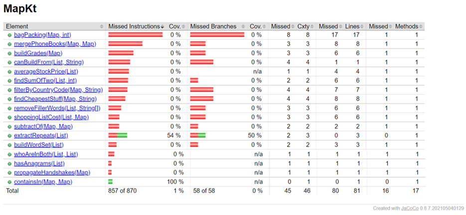
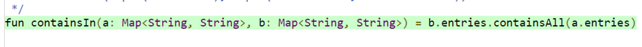
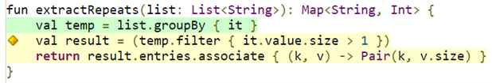
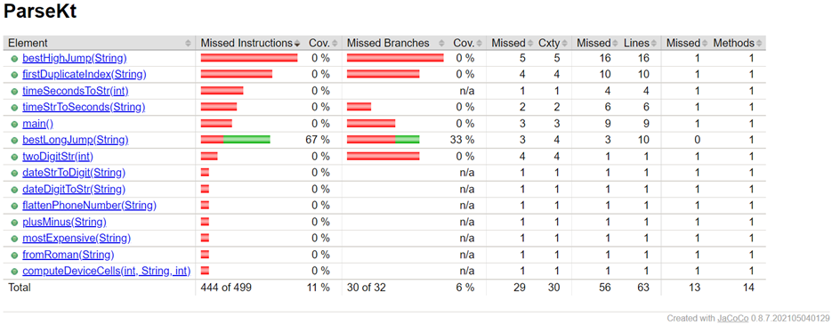
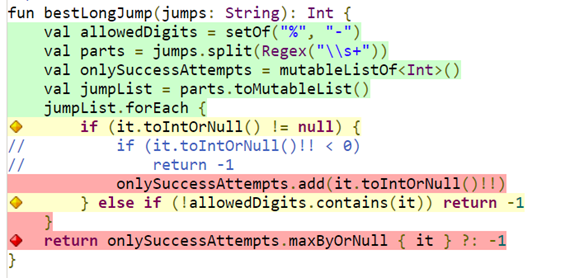
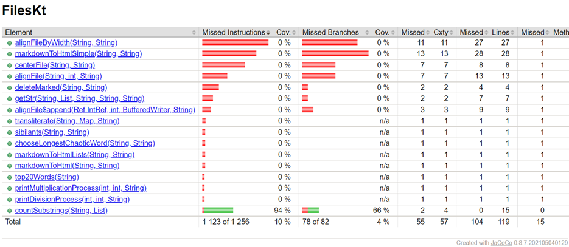
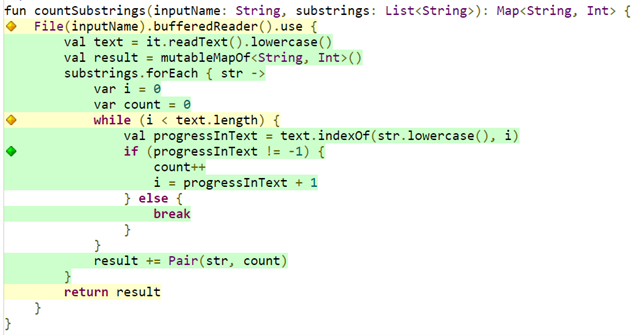

#Test Fuzzing Coverage Results

К качестве фаззера была выбрана библиотека JQF. Покрытие измерялось с помощью JaCoCo (который все-таки удалось найти в стандартных идеевских методах покрытия кода).

Были написаны тесты для классического фаззинга.

По резульатам фазз тестирование проходит не все ветки исходного кода.

## lesson5

### containsIn()

### extractRepeats()

## lesson6

### bestLongJump()

## lesson7

### countSubStrings()

Покрытие кода уже не 100% во всех случаях, как это было при самостоятельном написании юнит тестов. В некоторых ветках не происходит проверок, в основном это проверка специфических входных данных.

