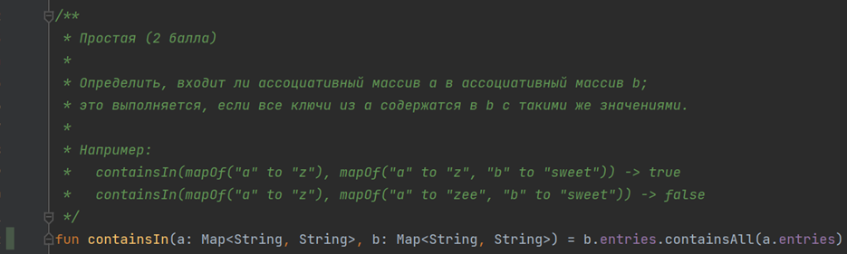
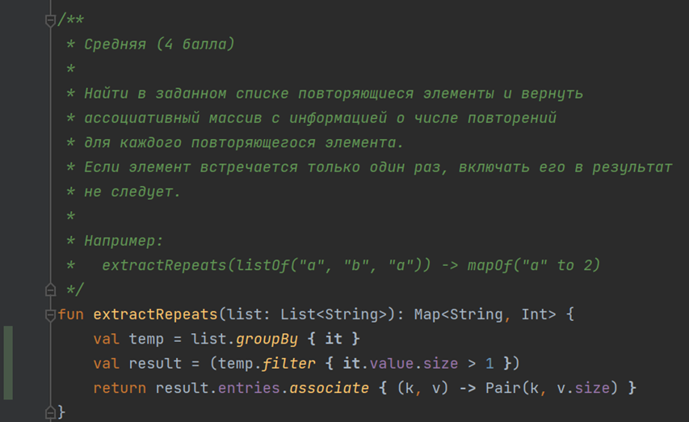
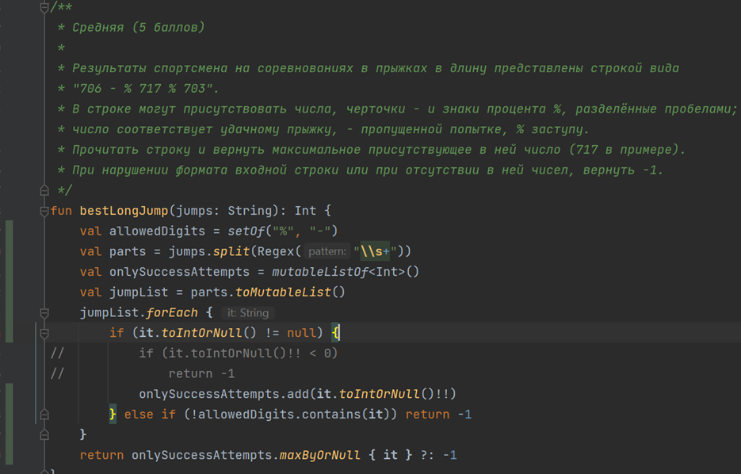
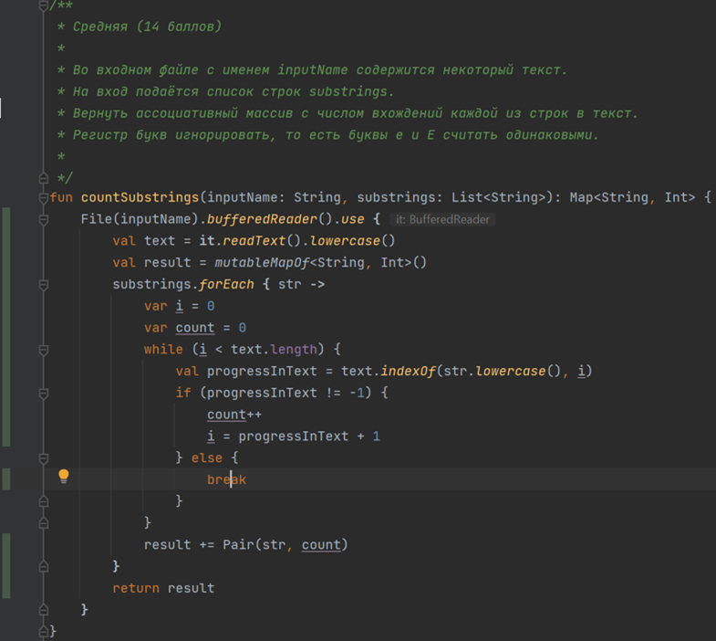

#Test Coverage Results

По резульатам оценки покрытикия тестируемого кода стандартные средства Intellij Idea показали 100% результат для всех написанных тестов.

Хочется отметить, что существуют более хорошие средства тестирования и примененный мной далеко не самый красивый и хорошо описывающий картину (особенно для одной задачи, написанной в одну строку с помощью лямбд).

## containsIn()

## extractRepeats()

## bestLongJump()

## countSubStrings()

PS Также хотелось отметить, что сначала хотелось использовать Jacoco, интегрирование происходит, но почему то в таргет-папке не появляется итоговый бин файл. После часа поптыток я решила использовать стандартные средства